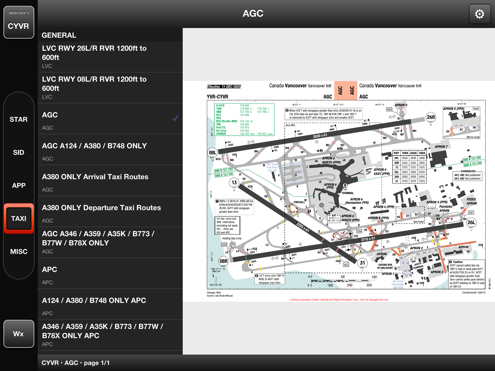
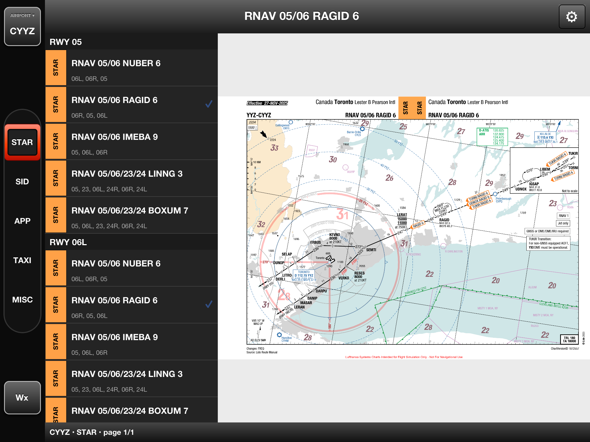
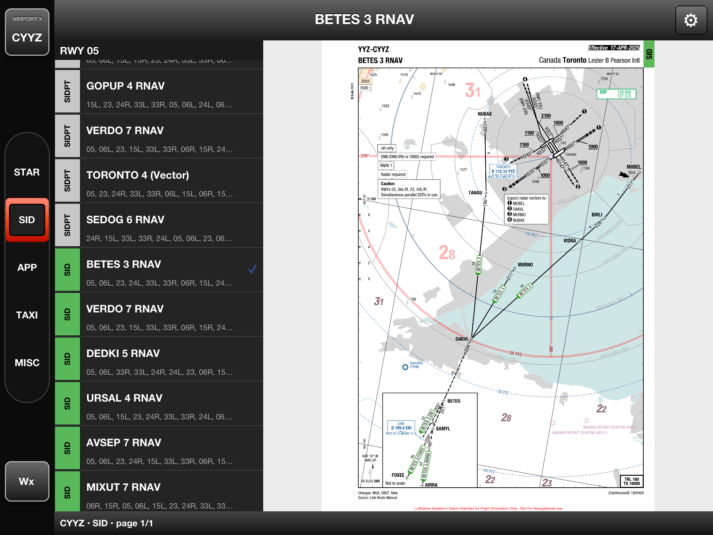
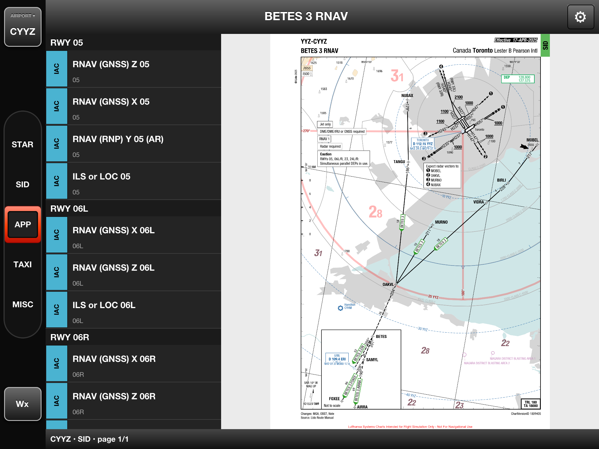
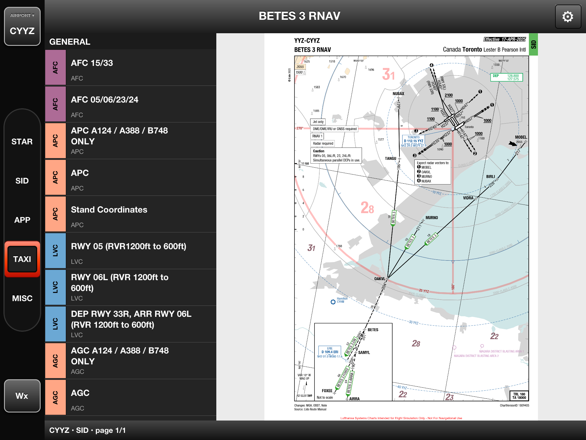
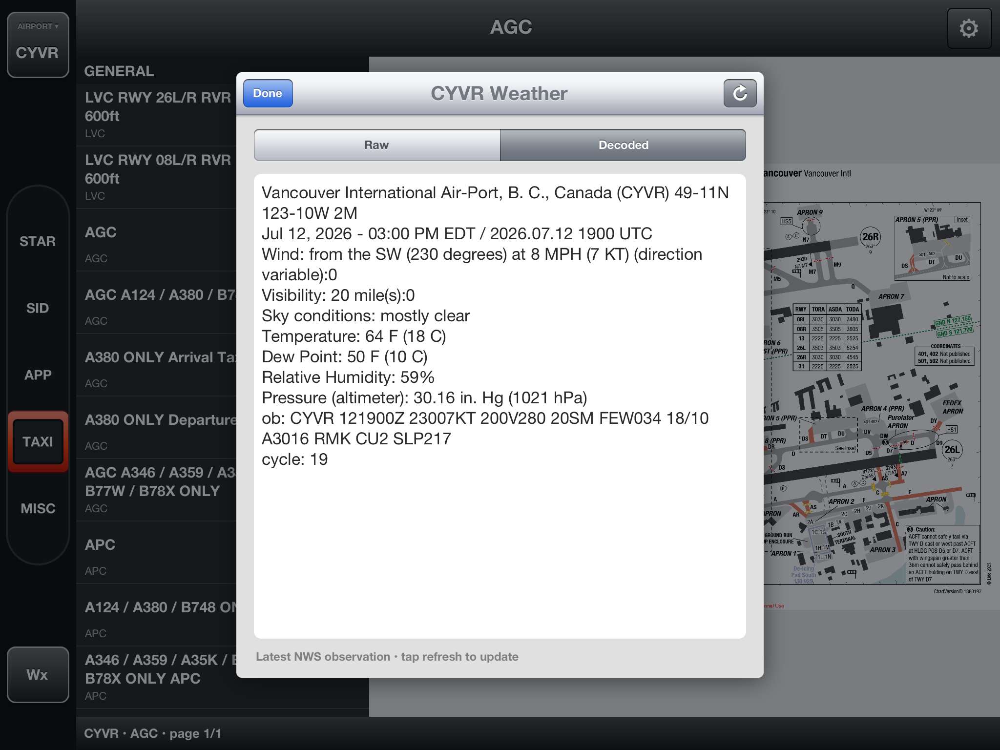
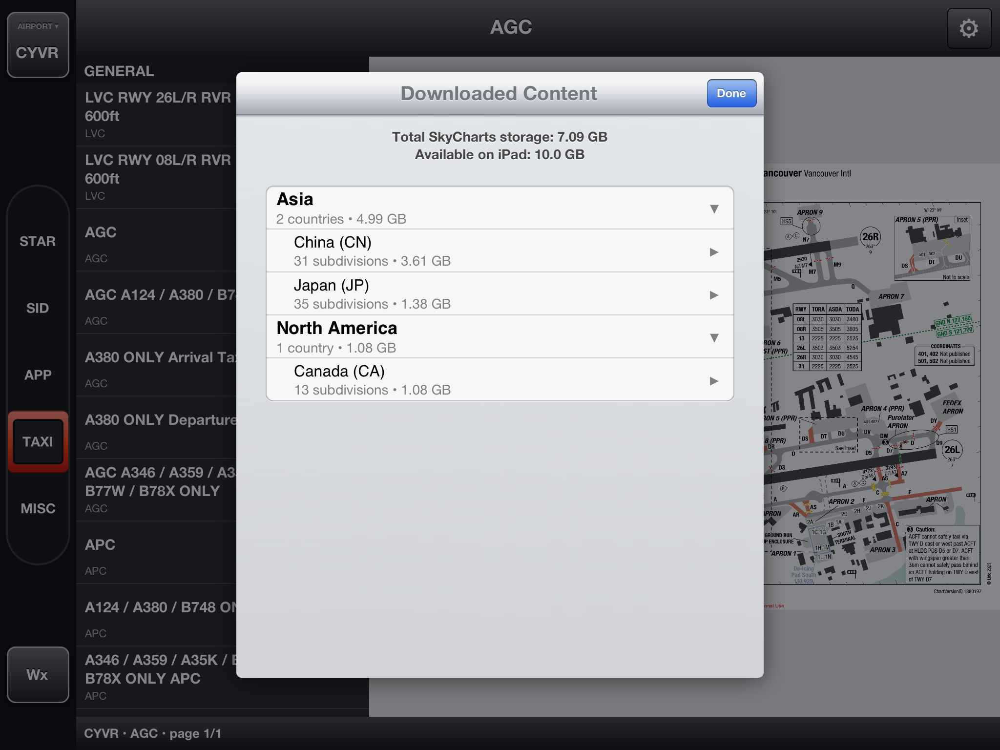
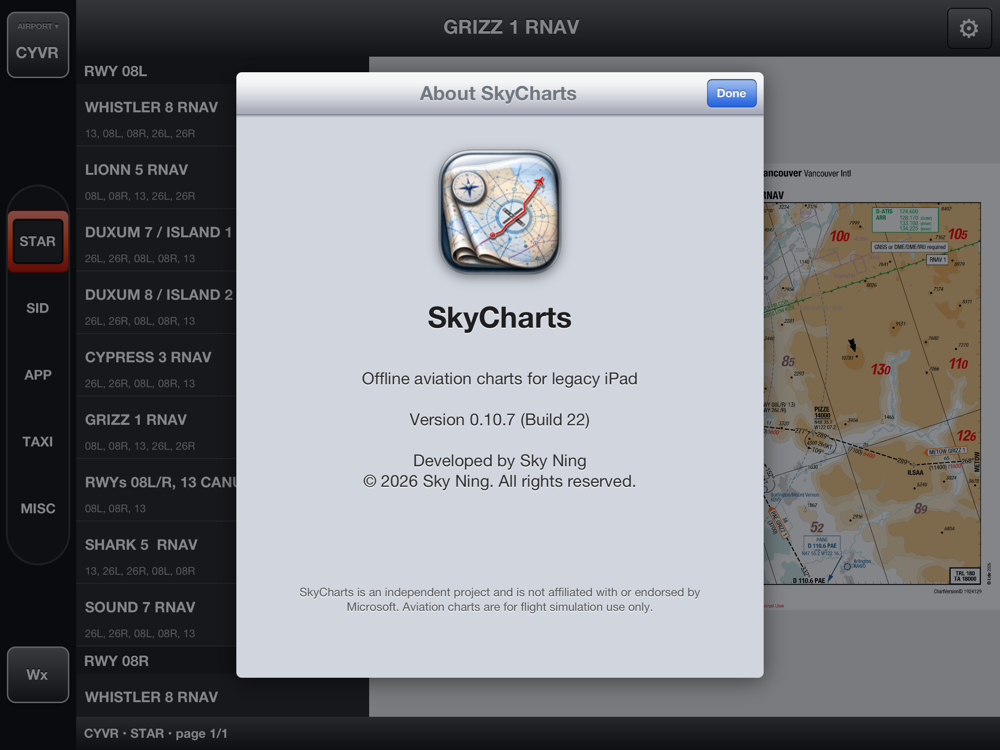

# SkyCharts

<p align="center">
  
</p>

SkyCharts brings an offline aviation-chart library to jailbroken iPads running iOS 6. The native UIKit application presents Microsoft Flight Simulator 2024 LIDO charts in a compact, Jeppesen-inspired interface designed for both portrait and landscape use.

> **For flight simulation only. SkyCharts and its chart content must not be used for real-world navigation.**

SkyCharts provides:

- Offline airport, arrival, departure, approach, taxi, and miscellaneous charts.
- Airport selection by four-character ICAO code.
- Five compact chart categories: **STAR**, **SID**, **APP**, **TAXI**, and **MISC**.
- Runway-grouped procedure lists and a collapsible chart sidebar.
- Pinch-to-zoom, panning, automatic centering, and orientation-aware chart fitting.
- Interactive offline airport maps with physically proportioned runways and aviation markings, repeated collision-aware taxiway identifiers, labelled terminals, aprons, gates, and parking stands.
- A viewport-sized, display-linked label layer that tracks the map continuously during pan and pinch gestures, keeps `Terminal X` identifiers visible, and uses progressive LOD fades and density limits for taxiway, gate, and stand labels.
- Touch inspection of airport-map features with ICAO references and available surface details.
- Current METAR weather in raw and decoded views.
- In-app combined chart-and-map downloads through a Mac on the same network.
- A geographic content manager with per-level storage usage and swipe-to-delete.
- A reusable Mac cache and single-stream TAR transfers for large offline libraries.

The app does not contain an Xbox login, planner cookie, relay, or web browser. A Mac downloads authorized chart assets from the planner and matching airport geometry from OpenStreetMap, then bundles both into one local pack and transfers it to the iPad. SkyCharts reads the complete package from `/var/mobile/Library/SkyCharts/ChartPacks`; legacy maps in `/var/mobile/Library/SkyCharts/AirportMaps` remain supported. Version 0.8 automatically migrates packs and preferences from an existing AtlasSix installation.

The earlier `relay/` service remains as an optional compatibility prototype; it is not required for the offline workflow.

## User guide

### 1. Prepare the Mac companion

Complete the [first-time setup](#first-time-setup), then launch the interactive client:

```sh
git clone https://github.com/skylarkning/SkyCharts.git
cd SkyCharts
./tools/skycharts
```

Choose **1. Sign in / refresh planner authentication** and complete the normal Microsoft/Xbox sign-in in the browser window. The client stores the planner session privately under `work/`; never publish or commit that authentication file.

Choose **2. Start Pack Agent for the iPad**, accept port `8770`, and leave the client running while the iPad downloads content. Only one Pack Agent can use a port at a time. If the client reports `Address already in use`, stop the existing agent with `Control-C` before starting another.

### 2. Download charts from the iPad

Tap the gear button in SkyCharts and choose one of these options:

- **Download by Country** — enter a two-letter ISO 3166-1 code such as `CA`, `US`, `CN`, or `JP`.
- **Download by ICAO Code** — enter one or more four-character airport codes separated by commas, such as `CYVR,CYYZ`.

When prompted for the agent address, enter `http://MAC-LAN-IP:8770`, replacing `MAC-LAN-IP` with the Mac's address on the local network. SkyCharts displays build percentage, installation percentage, file count, and estimated remaining time. Every requested airport pack includes its charts and interactive airport map; there is no separate map download. Keep the Mac agent running until the app reports that the package is installed.

### 3. Select an airport

Tap the airport button at the upper-left corner, enter a downloaded ICAO code, and tap **Select**. SkyCharts loads the airport's available chart categories and remembers the selection for the next launch.

If the app reports that an airport is not installed, download its country or request that ICAO code from the gear menu.

### 4. Browse and view charts

Use the vertical category selector on the left:

- **STAR** — arrival procedures.
- **SID** — departure procedures.
- **APP** — instrument approach charts.
- **TAXI** — airport, ground, parking, and taxi charts.
- **MISC** — remaining provider charts and airport information.

Tap a category to display its chart list, then tap a chart name to open it. Procedures with runway metadata are grouped beneath runway headers. Tap the currently selected category again to slide the chart list away and give the chart the full viewing area; tap it once more to reopen the list.

Use two fingers to zoom and one finger to pan. Charts automatically refit and recenter after loading, rotating the iPad, or collapsing the list.

### 5. Open an interactive airport map

Select an installed airport and tap **MAP** beside the gear button. The compact offline vector map was installed with that airport's charts and does not require the Mac Pack Agent to remain running.

Drag to pan, pinch to zoom, or tap **Fit** to show the entire airport. Runway geometry is merged into complete full-length surfaces and uses the source runway width to draw proportional pavement, edge lines, thresholds, centerlines, touchdown markings, aiming points, and designators. Named taxiway identifiers are sampled along the complete polyline and repeated at a consistent screen-space interval, including routes split into multiple source segments. The display-linked label layer follows the geometry during the gesture itself; progressively more taxiway, stand, and gate labels fade in as detail increases, while available `Terminal X` names remain visible at every zoom level. Grey taxiway pavement retains its natural map scale, while the independent yellow vector centerline adjusts continuously to maintain a fine screen-relative weight. Tap a runway, taxiway, parking stand, gate, apron, or terminal to inspect its available reference, name, and surface details.

The first stage is a north-up airport diagram; it does not yet display ownship position, routing, traffic, or NOTAMs. Map detail depends on OpenStreetMap coverage for the selected airport.

### 6. Check METAR weather

Tap **Wx** at the bottom-left. The weather window provides **Raw** and **Decoded** METAR views for the selected airport. Tap the refresh button to request the latest available observation. Weather requires an Internet connection even though installed charts work offline.

### 7. Manage downloaded content

Open the gear menu and choose **Manage Downloaded Content**. Expand the hierarchy:

```text
Continent → Country → State/Province/Region → City → Airport
```

Each level shows its unique chart and airport-map storage. The summary at the top shows total SkyCharts storage and free space remaining on the iPad. Swipe an airport, city, subdivision, country, or continent to delete all offline content beneath that level. Multi-airport packs are rewritten safely so unrelated airports remain installed.

### 8. View application information

Open the gear menu and choose **About SkyCharts** to see the installed version, build number, developer credit, copyright, and project disclaimer.

## Screenshots

<table>
  <tr>
    <td width="50%"><br><strong>STAR charts</strong> — orange type stripes identify arrival procedures.</td>
    <td width="50%"><br><strong>SID and SIDPT charts</strong> — procedure and transition types remain visually distinct.</td>
  </tr>
  <tr>
    <td width="50%"><br><strong>Approach charts</strong> — cyan IAC stripes accompany runway-grouped procedures.</td>
    <td width="50%"><br><strong>Airport chart families</strong> — AFC, APC, LVC, and AGC use consistent type colors.</td>
  </tr>
  <tr>
    <td width="50%"><br><strong>Expanded chart</strong> — collapse the list for a larger viewing area.</td>
    <td width="50%"><br><strong>METAR weather</strong> — raw and decoded observations.</td>
  </tr>
  <tr>
    <td width="50%"><br><strong>Downloaded content</strong> — geographic hierarchy and storage reporting.</td>
    <td width="50%"><br><strong>About SkyCharts</strong> — version and project information.</td>
  </tr>
</table>

## Repository layout

```text
SkyCharts/                Objective-C UIKit application
SkyCharts.plist           iOS application property list
Makefile and control      Theos armv7/iOS 6 build configuration
tools/                    Mac downloader, cache, pack agent, and CLI
relay/                    Optional authenticated planner relay prototype
docs/screenshots/         Application screenshots used by this README
work/                     Cookies, jobs, cache, and generated packs (ignored)
outputs/                  Local build artifacts (ignored)
```

## Requirements

On the Mac:

- macOS with Xcode command-line tools
- Theos, with `THEOS` pointing to its installation directory
- Theos-compatible iOS 6 SDK and armv7 toolchain
- Python 3
- A signed-in Microsoft Flight Simulator planner account
- Same-LAN access to the iPad for Pack Agent transfers

On the iPad:

- Jailbroken iPad running iOS 6
- SSH access as `root`
- Its LAN address, for example `192.168.2.19`

The downloader requires planner authentication. The Mac client opens a dedicated Chromium window, lets the user complete the normal Microsoft/Xbox login, detects the planner's `ApiToken`, and saves the Cookie header privately. Treat the saved file as a password: never commit or publish it.

## First-time setup

```sh
git clone https://github.com/skylarkning/SkyCharts.git
cd SkyCharts
export THEOS="$HOME/theos"
chmod 700 tools/skycharts tools/*.py
mkdir -p work
chmod 700 work
python3 -m venv .venv
.venv/bin/python3 -m pip install playwright
.venv/bin/python3 -m playwright install chromium
./tools/skycharts
```

Choose **Sign in / refresh planner authentication**. Complete the Microsoft/Xbox login in the browser window; the client automatically writes `work/msfs-cookie.txt` with mode `0600`. Its persistent browser profile is stored under ignored `work/` data, so later refreshes normally reuse the existing Microsoft session.

The browser flow can also be run directly:

```sh
python3 tools/skycharts_auth.py
```

If browser automation cannot be installed, the previous manual Cookie-header method remains a fallback: put the complete header value on one line in `work/msfs-cookie.txt` and run `chmod 600 work/msfs-cookie.txt`.

Validate the session without downloading a chart:

```sh
MSFS_COOKIE_FILE="$PWD/work/msfs-cookie.txt"
curl -sS -o /dev/null \
  -w 'HTTP %{http_code} — %{content_type}\n' \
  -H "Cookie: $(<"$MSFS_COOKIE_FILE")" \
  https://planner.flightsimulator.com/api/v1/token/expiry
```

HTTP 200 means the session is accepted. Renew the browser session and replace the file after a 401/403.

## Build the iOS 6 package

```sh
export THEOS="$HOME/theos"
make clean package
```

The package is written to `packages/`. To keep a convenient local copy:

```sh
mkdir -p outputs
cp packages/com.skyning.skycharts_*_iphoneos-arm.deb \
  outputs/SkyCharts-ios6-armv7.deb
```

The Makefile targets `iphone:clang:10.3:6.0` and `armv7`.

## Install, restart, and refresh SpringBoard

The iPad uses an old SSH server, so modern OpenSSH needs RSA compatibility flags:

```sh
IP=192.168.2.19
DEB=outputs/SkyCharts-0.14.2-ios6-armv7.deb

scp -O -o StrictHostKeyChecking=no \
  -o HostKeyAlgorithms=+ssh-rsa \
  -o PubkeyAcceptedAlgorithms=+ssh-rsa \
  "$DEB" root@$IP:/tmp/SkyCharts.deb

ssh -o StrictHostKeyChecking=no \
  -o HostKeyAlgorithms=+ssh-rsa \
  -o PubkeyAcceptedAlgorithms=+ssh-rsa \
  root@$IP 'dpkg -i /tmp/SkyCharts.deb'
```

The default password on many test jailbreaks is `alpine`; change it on a real device.

Restart the app:

```sh
ssh -o HostKeyAlgorithms=+ssh-rsa -o PubkeyAcceptedAlgorithms=+ssh-rsa \
  root@$IP 'killall SkyCharts 2>/dev/null || true'
```

Refresh the icon cache:

```sh
ssh -o HostKeyAlgorithms=+ssh-rsa -o PubkeyAcceptedAlgorithms=+ssh-rsa \
  root@$IP 'uicache'
```

If old jailbreaks report `cannot open cache file. incorrect user?`, run the cache refresh as mobile and respring:

```sh
ssh -o HostKeyAlgorithms=+ssh-rsa -o PubkeyAcceptedAlgorithms=+ssh-rsa \
  root@$IP 'su -s /bin/sh mobile -c "uicache"'
ssh -o HostKeyAlgorithms=+ssh-rsa -o PubkeyAcceptedAlgorithms=+ssh-rsa \
  root@$IP 'killall SpringBoard 2>/dev/null || true'
```

## Build an offline chart pack

The downloader keeps reusable chart assets in `work/chart-cache` and reusable vector maps in `work/airport-map-cache`. Rebuilding a pack reuses both caches and hard-links chart pages into new output when possible. Light chart assets are downloaded by default. Each exported pack contains both its charts and `maps/ICAO.json` vector-map assets.

Selected airports:

```sh
python3 tools/skycharts_downloader.py airport KJFK KLGA \
  --cookie-file work/msfs-cookie.txt \
  --pack-id new-york-demo --name "New York Demo" \
  --output outputs/new-york-demo --workers 8
```

Country pack:

```sh
python3 tools/skycharts_downloader.py country CA \
  --cookie-file work/msfs-cookie.txt \
  --pack-id canada --name "Canada" \
  --output outputs/canada --workers 8
```

Useful options are `--limit 10` for a trial, `--workers 16` for more concurrency, `--cache-dir PATH` to relocate the reusable cache, `--refresh-airports` to refresh the OurAirports index, `--types all` to include every airport type, and `--include-dark` when dark PNG assets are explicitly needed.

Install an existing pack directly over SSH:

```sh
python3 tools/skycharts_downloader.py install \
  outputs/new-york-demo --host 192.168.2.19
```

The installer stages into a temporary directory, validates `pack.json`, and atomically moves the pack into `ChartPacks`. Failed transfers remove partial files.

## Interactive Mac client

```sh
./tools/skycharts
```

The menu handles browser authentication, starts the Pack Agent, builds combined chart-and-map country or selected-airport packs, installs packs over SSH, and reports both cache types.

- Choose **Manage cached airport packages** to search by airport ICAO or name, inspect combined chart/page/map counts and storage, delete both reusable chart and map data for selected airports, remove unidentified legacy entries, or clear the complete reusable cache. Shared chart GUIDs are retained while an unselected airport still references them.

Both managers remove reusable cache entries only; exported packs, Pack Agent jobs, and content already installed on the iPad remain intact. Because chart pages may be hard-linked into an existing pack or Pack Agent job, the logical cache size removed can be larger than the immediately reclaimed disk space. If no cookie file exists, authenticated operations automatically offer browser login.

The pack builder uses OpenStreetMap aviation features and writes a compact normalized JSON map into every airport entry. No additional Python package is required. SkyCharts displays the required OpenStreetMap attribution in the map footer. Only identifiers present in the source data are labelled; unnumbered parking-position geometry remains visible without an invented stand number. OpenStreetMap data is available under the [Open Database License](https://www.openstreetmap.org/copyright).

## In-app downloads through Pack Agent

Start the LAN agent:

```sh
python3 tools/skycharts_pack_agent.py \
  --cookie-file work/msfs-cookie.txt --host 0.0.0.0 --port 8770
```

Check it from the Mac:

```sh
curl http://127.0.0.1:8770/health
```

After upgrading the tools, stop any currently running agent with `Control-C` and start it again so Python loads the new protocol. The health response should include `"transfer":"ustar-v1"`.

In SkyCharts, open the gear menu, choose a download option, and enter `http://MAC-LAN-IP:8770`. The app can request a country or comma-separated ICAO codes and polls the job. A completed job is packaged as one uncompressed USTAR stream; the app extracts that single HTTP transfer directly to temporary storage with bounded memory, validates `pack.json`, and atomically activates the pack. This avoids thousands of serial PNG requests. Keep the agent running until installation completes. SkyCharts retains the older per-file protocol only as a fallback for an agent that has not yet been restarted or upgraded.

While a pack is being built, the footer shows overall completion percentage and an estimated remaining time. The estimate uses elapsed time plus global airport/chart progress and becomes more accurate after the first few charts complete. During the subsequent iPad transfer, the footer switches to file count, transfer percentage, and a separate transfer ETA.

Large installations are parsed incrementally from 512-byte TAR headers and written directly to their destination files. Each network callback uses a short-lived autorelease pool, no complete archive or PNG collection is retained in memory, and files are activated only after the transfer and manifest pass validation. Internal `@@SKYCHARTS_PROGRESS` telemetry is enabled only for Pack Agent subprocesses and is hidden from normal Mac-client output.

## Chart categories

Provider categories are normalized into five compact Jeppesen-style sections:

```text
STAR        STAR, STARPT, arrival procedure types
SID         SID, SIDPT, departure procedure types
APP         IAC and approach procedure types
TAXI        AGC, APC, AFC, LVC, ADC, APT
MISC        Any remaining provider type, including AOI
```

The five controls sit inside a long dark vertical pill with protected space above STAR and below MISC, so the active orange selector remains fully visible at both ends. Tapping the selected category hides or reveals the chart list with a smooth leftward slide and fade while the chart viewer resizes. Every chart row carries a color-coded vertical stripe labeled with its exact LIDO type, including SID, SIDPT, STAR, STARPT, IAC, AGC, APC, AFC, LVC, MRC, and AOI. Within a section, runway charts are grouped under headers such as `RWY 10L` and `RWY 19R`; charts without runway metadata appear under `GENERAL`.

Downloaded content is managed entirely through a collapsible location hierarchy: continent → ISO 3166-1 country → ISO 3166-2 state/province/region → city → airport. Every row reports the unique installed chart size beneath that branch. A storage summary above the hierarchy shows total SkyCharts disk usage and currently available iPad space. Swipe any level to delete all matching charts; airport- and city-level deletion rewrites multi-airport manifests and removes only assets no longer referenced, while an emptied package directory is removed automatically.

The app includes iOS 6 icon assets at 57, 72, 114, and 144 pixels, generated from `SkyCharts/Resources/SkyChartsIcon-1024.png` with transparent outer corners and prerendered artwork.

## METAR weather

The beveled `Wx` button at the bottom of the category rail matches the airport selector and opens a compact iOS 6 weather window for the selected airport. It offers Raw and Decoded views plus manual refresh. Weather is read directly from the latest worldwide station files published by the U.S. National Weather Service over anonymous FTP, avoiding modern HTTPS requirements that iOS 6 cannot satisfy.

The Settings menu includes **About SkyCharts**, an iOS 6-style page showing the app logo, installed version and build, developer credit, copyright, and project disclaimer.

## Optional legacy relay

The relay is for troubleshooting and API experiments only:

```sh
cd relay
chmod 600 ../work/msfs-cookie.txt
MSFS_COOKIE_FILE=../work/msfs-cookie.txt python3 msfs_chart_relay.py
```

See [relay/README.md](relay/README.md) for endpoints. Never commit cookies, signed URLs, or logs containing request headers.

## Troubleshooting

- **401/403 from planner:** choose **Sign in / refresh planner authentication** in `./tools/skycharts`.
- **Browser login dependency missing:** run `python3 -m venv .venv`, `.venv/bin/python3 -m pip install playwright`, and `.venv/bin/python3 -m playwright install chromium`. The launcher automatically uses this isolated environment.
- **Weather unavailable:** confirm the iPad has Internet access. Some airports do not publish METAR reports, and the NWS station may temporarily be unavailable.
- **Pack build failed:** inspect terminal output and `work/pack-agent/*.log`; check cookie, Internet access, and planner availability.
- **Pack transfer failed:** verify the iPad and Mac are on the same LAN, port 8770 is reachable, and iPad storage is available. Cached assets make retries faster.
- **`uicache` cache-file error:** run it as `mobile` and respring SpringBoard using the commands above.
- **Missing chart:** use the gear menu's content manager to confirm the pack and airport are installed; rebuild if `pack.json` references missing PNGs.

## GitHub backup

Generated credentials, packs, caches, build products, and Python bytecode are excluded by `.gitignore`. Create the first local commit:

```sh
git init
git add .
git status
git commit -m "Initial SkyCharts iOS 6 offline chart viewer"
```

The canonical repository is `skylarkning/SkyCharts`. Add its URL and push:

```sh
git branch -M main
git remote add origin git@github.com:skylarkning/SkyCharts.git
git push -u origin main
```

HTTPS alternative:

```sh
git remote add origin https://github.com/skylarkning/SkyCharts.git
git push -u origin main
```

Verify future backups with:

```sh
git status
git log --oneline --decorate -5
git remote -v
```

## Responsible use

Chart data comes from the Microsoft Flight Simulator planner and its provider. Access, caching, redistribution, and validity are governed by the applicable account and provider terms. Download only data you are authorized to use and do not publish cookies, signed URLs, or restricted chart packs.
